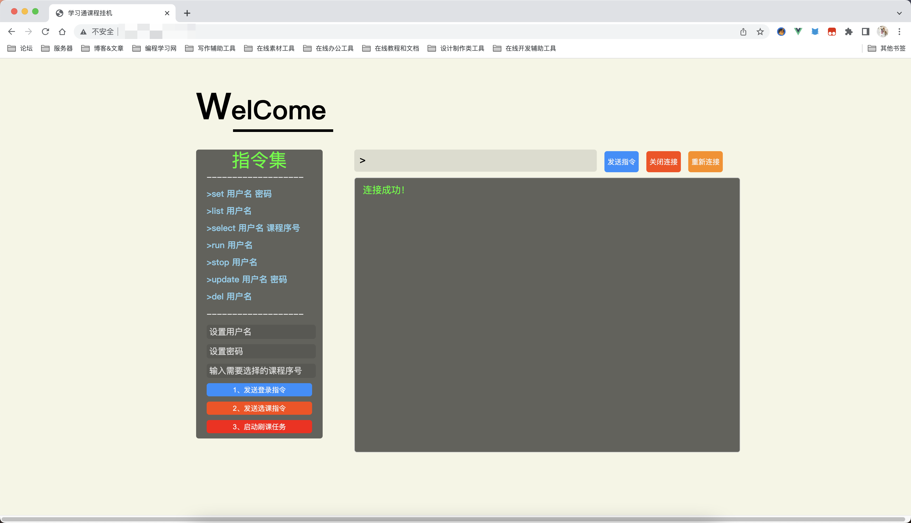
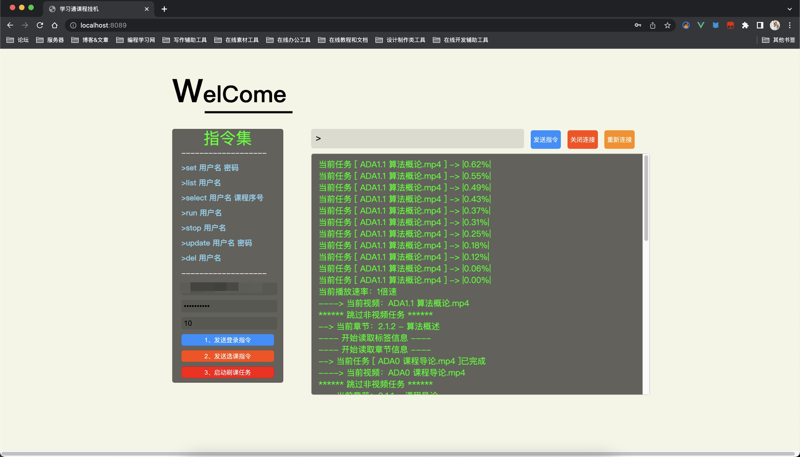

#  超星学习通自动化完成任务点

**此项目使用语言为JAVA语言，可本地化直接命令行运行，也可如下图基于Springboot启动管理，通过websocket添加用户并执行刷课命令。**

**主要根据这个项目改的https://github.com/Samueli924/chaoxing。**

>  到处扣来的学习通自动挂机刷课，支持多用户多任务【估计行吧】，写的挺乱，但是胜在能用，多的我就不说了，会搞得自行观看下载。

